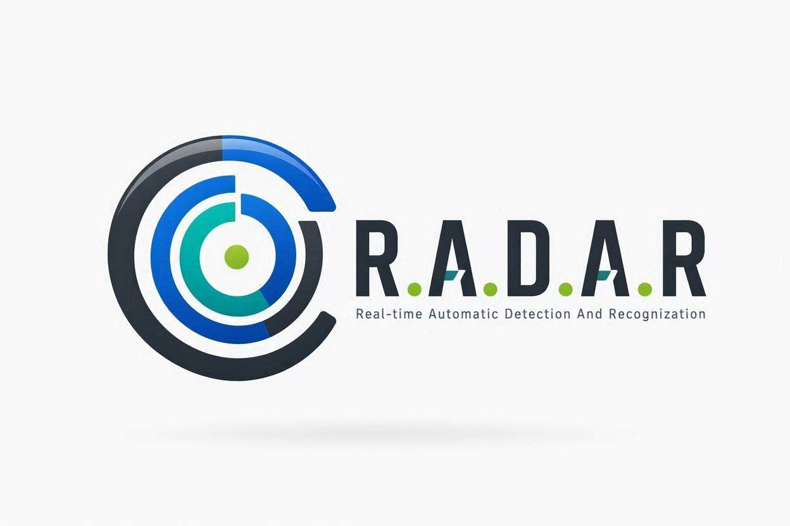

# R.A.D.A.R

<p align="center">
	
</p>

<h1 align="center">
  
</h1>

<p align="center">
	
</p>

<p align="center">
	
	
	
	
</p>

<p align="center">
	Real-time Automatic Detection And Recognition for vehicle tracking and automatic number plate recognition.
</p>

---

## Overview

R.A.D.A.R is an end-to-end Automatic Number Plate Recognition (ANPR) pipeline built for noisy, real-world traffic footage. It combines YOLOv8-based vehicle tracking, a custom-trained license plate detector, OCR-based text extraction, and interpolation logic to keep detections stable across dropped frames.

This project was developed as a term project for the B.Sc. (Honours) Data Science and Artificial Intelligence program at the Indian Institute of Technology (IIT) Guwahati.

---

## Highlights

- Dual-model detection pipeline using `yolov8n.pt` for vehicle tracking and `yolo26n.pt` for license plate localization.
- SciPy-based interpolation to smooth missing bounding-box coordinates and reduce flicker.
- OCR workflow designed for practical traffic scenes, with preprocessing and confidence filtering.
- Spatial validation that only accepts plates detected inside a tracked vehicle box.
- Streamlit dashboard support for a more interactive workflow.

---

## How It Works

1. A vehicle is tracked with YOLOv8.
2. The custom plate detector searches for license plates inside the current frame.
3. The plate crop is preprocessed and sent to OCR.
4. Valid text is filtered and written to structured output.
5. Interpolation fills gaps to keep the final track smooth.

---

## Project Structure

```text
R.A.D.A.R/
├── assets/
│   ├── Logo.jpg
│   └── output_gif.gif
├── License Plate Recognition.v11i.yolov8/
├── License_Plate_10k/
├── src/
│   ├── anpr_utils.py
│   ├── app.py
│   ├── main.py
│   ├── visualization.py
│   └── preprocessing/
├── yolo26n.pt
├── yolov8n.pt
├── pyproject.toml
├── requirements.txt
└── README.md
```

---

## Installation

### Option 1: Using `uv` recommended

```bash
git clone https://github.com/YourUsername/RADAR.git
cd RADAR
uv venv
```

Activate the environment:

```bash
.venv\Scripts\activate
```

Install dependencies:

```bash
uv pip install -r requirements.txt
```

### Option 2: Using pip

```bash
git clone https://github.com/YourUsername/RADAR.git
cd RADAR
python -m venv .venv
.venv\Scripts\activate
pip install -r requirements.txt
```

---

## Usage

Run the main ANPR pipeline on the sample video:

```bash
python src/main.py sample_30fps.mp4
```

Launch the dashboard:

```bash
streamlit run src/app.py
```

If you want to process your own video, replace `sample_30fps.mp4` with the path to your file.

---

## Dependencies

The core Python packages are listed in `requirements.txt` and currently include:

- OpenCV
- EasyOCR
- SciPy
- PyTorch
- Ultralytics YOLO
- Streamlit
- Plotly
- LangChain integrations used by the dashboard

---

## Dataset and Credits

The custom license plate detector was trained on the Roboflow License Plate Recognition dataset hosted on Roboflow Universe.

Special thanks to:

- Roboflow and the open-source computer vision community
- Ultralytics for YOLOv8
- JaidedAI for EasyOCR

---

## Author

Onkar Upadhyay

B.Sc. (Honours), Data Science and Artificial Intelligence

Indian Institute of Technology (IIT) Guwahati

---

## License

This repository includes model weights and dataset-derived assets that may have separate terms. See `LICENSE-WEIGHTS` for weight-specific licensing details.

